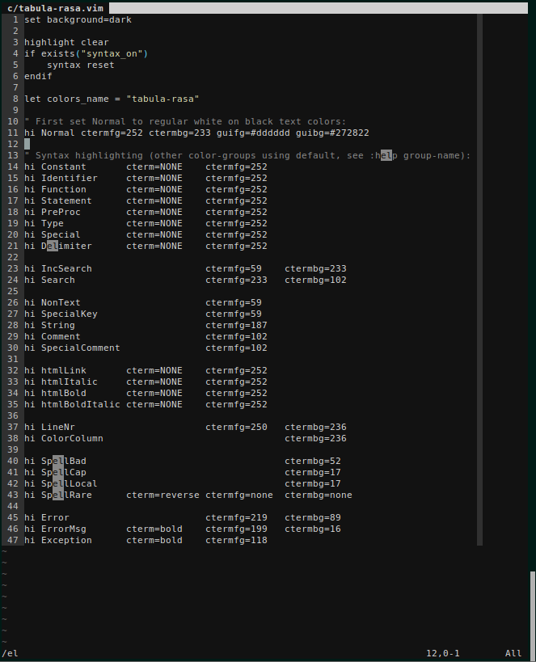

This is an obscenely basic colorscheme for removing syntax highlighting from
your life without sacrificing your sense of taste. Strings and comments are
still highlighted.

It looks like this:

I wanted to call it "void" but there was already a dark, minimalist colorscheme
with that name. Not that it matters for much with such a minimal colorscheme,
but this is based on the excellent [molokai](https://github.com/tomasr/molokai),
which you should totally use if you still want syntax highlighting.
